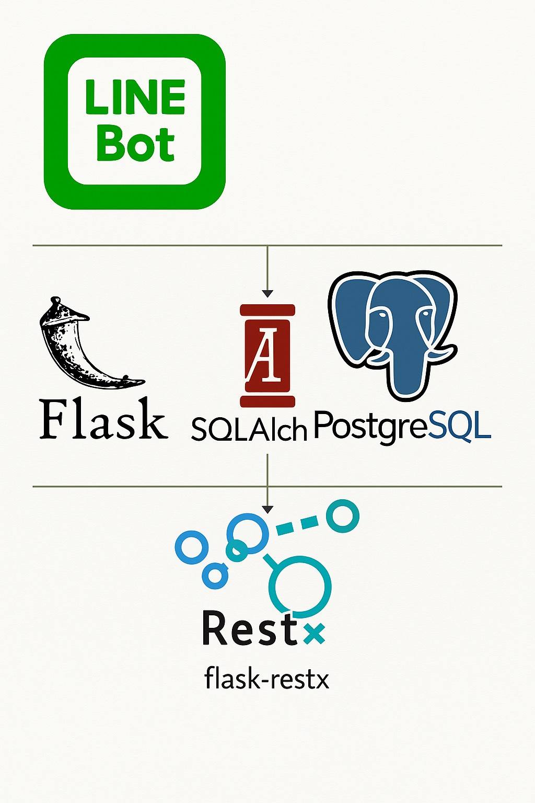
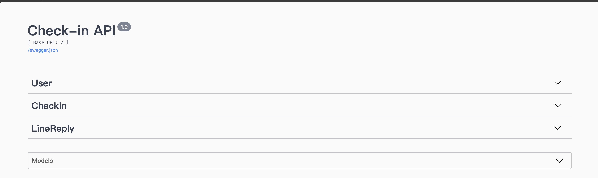
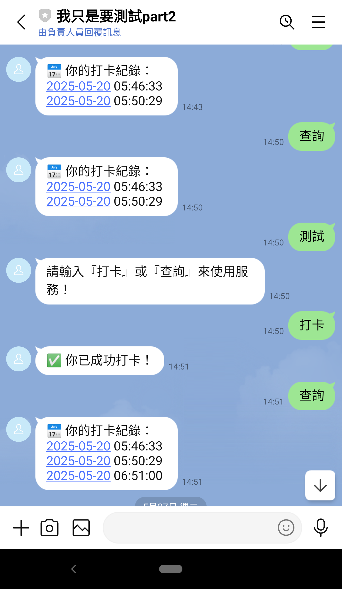

# LINE Bot 打卡系統

一個基於 Flask + Flask-RESTX 的 LINE Bot 打卡後端範例專案，整合了以下技術：

- **Flask**：輕量級 Python Web 框架
- **Flask-RESTX**：自動產生 Swagger/OpenAPI 文件
- **SQLAlchemy**：ORM，操作 PostgreSQL
- **LINE Messaging API**：處理 Webhook 與文字互動
- **Python 3.9+**：使用內建 `zoneinfo` 處理前端時區顯示的問題

---

## 功能特色

- `/api/register`：註冊新 LINE 使用者
- `/api/users`：查詢所有註冊使用者
- `/api/checkin`：使用者打卡
- `/api/checkins/<user_id>`：查詢指定使用者的打卡紀錄
- `/api/line_reply`：後端儲存 LINE 回覆文字
- `/callback`：LINE Webhook 入口，支援「打卡」與「查詢」指令
- **Swagger UI**：自動產生 API 文件，支援即時測試（`/docs`）
- **時區轉換**：API 回傳與 LINE Bot 回覆都會將 UTC 時間轉為本地（Asia/Taipei）

---

## 系統架構圖



## 快速上手

### 1. 取得原始碼

```bash
git clone https://your-repo-url.git
cd test_python_flask
```

### 2. 建立虛擬環境並安裝套件

```bash
python3 -m venv venv
# macOS / Linux
source venv/bin/activate
# Windows (PowerShell)
venv\Scripts\Activate.ps1

pip install -r requirements.txt

或是使用自己熟悉的開發工具建立環境
```

### 3. 建立 `.env`

請在專案根目錄新增 `.env`，內容如下：

```env
# 資料庫連線字串，PostgreSQL 範例；本地測試可改用 sqlite:///test.db
MYSQL_PUBLIC_URL=postgresql+psycopg2://自己的database host

# LINE Bot 憑證
LINE_CHANNEL_ACCESS_TOKEN=你的ChannelAccessToken  
LINE_CHANNEL_SECRET=你的ChannelSecret  
```

### 4. 啟動應用

```bash
python app.py
```

- 服務預設跑在 `http://127.0.0.1:5000`
- Swagger UI：`http://127.0.0.1:5000/docs`

## 實際Swagger UI畫面


---

## API 範例

### 註冊新用戶

```bash
curl -X POST http://localhost:5000/api/register \
  -H "Content-Type: application/json" \
  -d '{"line_user_id":"U1234567890","name":"Alice"}'
```

### 查詢所有用戶

```bash
curl http://localhost:5000/api/users
```

### 使用者打卡

```bash
curl -X POST http://localhost:5000/api/checkin \
  -H "Content-Type: application/json" \
  -d '{"line_user_id":"U1234567890"}'
```

### 查詢打卡紀錄

```bash
curl http://localhost:5000/api/checkins/1
```

### 存 LINE 回覆文字

```bash
curl -X POST http://localhost:5000/api/line_reply \
  -H "Content-Type: application/json" \
  -d '{"user_id":1,"reply_message":"Hello!"}'
```

---

## 後端架構說明

1. ``\
   將 `db = SQLAlchemy()` 抽出，避免 `app.py` → `routes/*.py` → `app.py` 循環匯入。

2. ``\
   對應三張資料表：`User`、`Checkin`、`LineReply`，全部以 UTC 儲存時間。

3. ``\*\* + Flask-RESTX\*\*

   - `user_routes.py`、`checkin_routes.py`、`line_reply_routes.py`：使用 `Namespace` + `Resource` 定義路由與參數驗證。
   - `webhook.py`：LINE Webhook 處理，並利用 `services/line_service.py` 做用戶自動註冊與回覆封裝。

4. ``\
   集中初始化 `LineBotApi`、`WebhookHandler`，並提供 `ensure_user_registered()`、`reply_to_user()` 等函式。

5. **時區轉換**

   - 資料庫一律以 UTC 儲存
   - API 回傳與 LINE Bot 回覆時，將時間轉為 `Asia/Taipei`

---
### Linebot實際畫面

---

## License

本專案採用 MIT License，詳見 [LICENSE](LICENSE) 檔。

